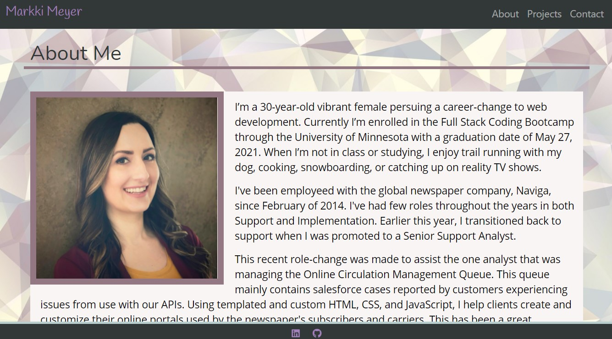

# 
 **React Portfolio** 

 

## Description
This React.js app is a portfolio that showcases an About Me, Gallery, and Contact page for Markki Meyer. 

-----  
## Table of Contents

* [Usage](#usage)
* [License](#license)
* [Questions](#questions)

----- 
## Usage
The site is live here: https://markkimeyer.github.io/reactProfile/.

<ul>
<li>Click the 'About Me' header in the navigation bar to see the home page which features a professional headshot and a description. </li>
<li>Click 'Gallery' to see a gallery of my completed projects. Click on the icon to navigate to the live page. Click on the Repository button to navigate to the Github repository.  </li>
<li>Click 'Contact Me' to be presented with professional documents, links, and the option to email me. The current features are: 
<ol>
<li>Resume, which opens my Resume on google drive document where the file is able to be saved</li>
<li> Contact Me, which opens an email template via MailChimp that will be sent to my inbox</li>
<li>Linked In: This button navigates to my linked in page.</li>
<li> GitHub: This button opens my GitHub profile. </li>
</ul>

You can also navigate to the following routes to access the pages: 
<ul>
<li>/Home is the About Me page. </li>
<li>/Gallery is the gallery of my completed projects. </li>
<li>/Contact is the Contact Me page. </li>
</ul>

----- 

  ## License
  Licensed under the [MIT](https://spdx.org/licenses/MIT.html) license.
  
----- 

## Questions
For additional questions, find me on [GitHub](https://github.com/athear) or [email](markkimeyer@gmail.com) me. 
